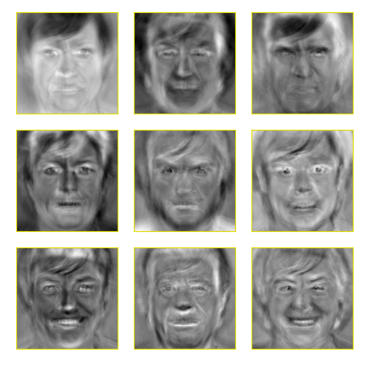

# color eigenfaces
Are you tired of all these boring grey scale [eigenfaces](https://en.wikipedia.org/wiki/Eigenface)???



## Create your own colored eigenfaces album.

Opencv is used to crop faces from all images in a directory. Then, [PCA](https://en.wikipedia.org/wiki/Principal_component_analysis) is applied to get the eigenfaces.  


### Usage:
`python3 color_eigenfaces.py -h` to see help menu.

### Requires:
python3, opencv, numpy, sklearn, matplotlib, imageio.

```bash
pip3 install opencv-python matplotlib numpy imageio sklearn
```
